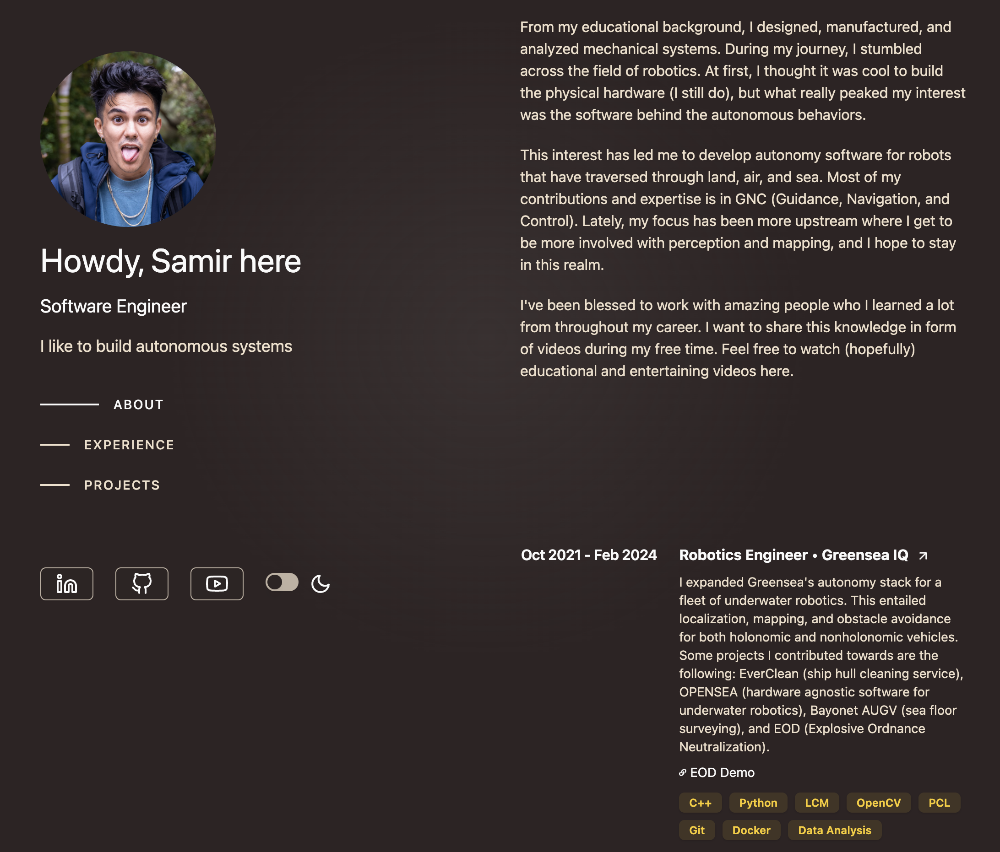

<div align="center">
  
</div>

<h1 align="center">
  <a href="https://portfolio-phi-rouge-50.vercel.app/" target="_blank">https://portfolio-phi-rouge-50.vercel.app/</a>
</h1>

<p>
Portfolio personal desarrollado por <strong>Juan Carlos López Morales</strong>, inspirado en el diseño de <a href="https://brittanychiang.com" target="_blank">Brittany Chiang</a>. Creado con Next.js, Tailwind CSS y shadcn/ui para reflejar mis proyectos, experiencia y trayectoria como desarrollador frontend.
</p>

<div align="center">
  
</div>

## 🚀 ¿Puedo usar este repositorio?

Sí, puedes usar el código como base para tu portfolio. Te recomiendo:

- Atribuir el diseño original a [brittanychiang.com](https://brittanychiang.com)
- Y si te ayuda el código, también agradecería una mención a [https://portfolio-phi-rouge-50.vercel.app/](https://portfolio-phi-rouge-50.vercel.app/)

---

## 🛠️ Comenzar

Primero, instala dependencias y lanza el entorno local:

```bash
npm install
npm run dev
